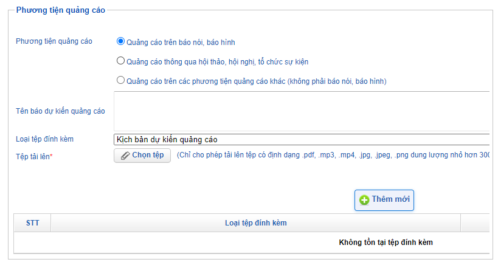

# Hướng dẫn đăng ký quảng cáo thuốc
Thực hiện đăng ký quảng cáo thuốc theo hướng dẫn của thủ tục có mã sô BYT-286926 trên cơ sở dữ liệu quốc gia về thủ tục hành  chính.

## Hồ sơ đăng ký
Hồ sơ đăng ký quảng cáo thuốc bao gồm:
1. Đơn đề nghị xác nhận nội dung quảng cáo thuốc [ND54_Mau01_PhuLucVI](http://csdl.thutuchanhchinh.vn/TW/Lists/ThanhPhanHoSo/Attachments/233730/ND%2054_Mau%2001_Phuluc%20VI.docx) <Badge text="bản chính" type="tip" />
2. Nội dung quảng cáo thuốc 
3. Mẫu nhãn, tờ hướng dẫn sử dụng thuốc đã được Cục quản lý Dược phê duyệt <Badge text="dấu treo" type="warn" />
4. Tài liệu tham khảo có liên quan đến nội dung quảng cáo thuốc (nếu có) <Badge text="công chứng" type="error" />
5. Giấy phép lưu hành sản phẩm <Badge text="dấu treo" type="warn" />
6. Giấy chứng nhận đăng ký kinh doanh <Badge text="công chứng" type="error" />, Giấy đủ điều kiện kinh doanh dược <Badge text="công chứng" type="error" />

**Nội dung quảng cáo:** Tùy theo loại hình quảng cáo mà nội dung quảng cáo kèm theo trong hồ sơ có thể là maquette mẫu in (nếu quảng cáo dạng in ấn), đĩa ghi âm, ghi hình và kịch bản (nếu quảng cáo dạng trên báo nói, báo hình, thiết bị điện tử...)

:::tip 
Nếu sản phẩm chưa có tờ giấy phép lưu hành thì có thể thay thế bằng Quyết định cấp giấy đăng ký.
:::

**Tài liệu tham khảo có liên quan:**
- Nếu mẫu quảng cáo có sử dụng của số liệu nghiên cứu lâm sàng thì đính kèm nghiên cứu lâm sàng.
- Nếu mẫu quảng cáo có sử dụng hình ảnh các [danh hiệu, giải thưởng](https://docs.google.com/spreadsheets/d/1Zue-tOhOoYqT-OfpxysWW1gQuMkJKhcVl1QWGaALG8c/edit?usp=sharing) thì đính kèm quyết định (thưởng sử dụng là Thương hiệu quốc gia, Hàng Việt Nam chất lượng cao, Ngôi sao thuốc Việt). Bằng khen/ Giấy chứng nhận có giá trị tương đương Quyết định khen thưởng.

Phí xác nhận nội dung quảng cáo thuốc: 1.600.00 đồng/hồ sơ.

## Quy trình
1. Sau khi thiết kế xong thì trình ký Tổng [Đơn đề nghị xác nhận nội dung quảng cáo thuốc](http://csdl.thutuchanhchinh.vn/TW/Lists/ThanhPhanHoSo/Attachments/233730/ND%2054_Mau%2001_Phuluc%20VI.docx) (Đơn này chỉ lưu nội bộ). Xem thêm [Yêu cầu nội dung khi thiết kế](./content-requirements.md#quang-cao-thuoc).
2. Nộp hồ sơ tại website [Dịch vụ công trực tuyến](https://dav.gov.vn/dich-vu-cong-c5.html) của CQLD. Thực hiện ký số vào đơn trực tuyến (P. HCQT giữ token).
3. Thanh toán phí xác nhận nội dung quảng cáo (hình thức chuyển khoản vào tài khoản VPBank theo thông tin trên Giấy báo thu).
4. Lấy biên lai sau khi thanh toán (phối hợp với CN Hà Nội - mang theo Giấy giới thiệu, Ủy nhiệm chi).
5. Cục xem xét hồ sơ và cấp Giấy xác nhận nội dung quảng cáo hoặc yêu cầu sửa đổi, bổ sung.

Thời gian thông thường để được xác nhận nội dung cho 1 mẫu quảng cáo khoảng 3 tháng (với trung bình khoảng 1 lần góp ý).

::: warning
Theo dõi tình trạng hồ sơ định kỳ mỗi tuần tại website [Dịch vụ công trực tuyến](https://dav.gov.vn/dich-vu-cong-c5.html).
:::

## Hướng dẫn
* Đối với quảng cáo in ấn: cần ghi rõ tỷ lệ của maquette so với thực tế.
* Đối với quảng cáo màn hình chuyên quảng cáo, trang thông tin điện tử, website: liệt kê thứ tự xuất hiện của các trang, chuyển động của các phần tử trên trang -> gọi chung là Kịch bản xuất hiện.
* [Phương tiện quảng cáo:](./media.md) thông thường sẽ có 3 nhóm phương tiện sau:
	- Quảng cáo trên báo nói, báo hình.
	- Quảng cáo thông qua hội thảo, hội nghị, tổ chức sự kiện.
	- Phương tiện khác: tờ rơi, brochure, báo điện tử, trang thông tin điện tử, thiết bị điện tử, màn hình chuyên quảng cáo, website doanh nghiệp, website của đơn vị làm dịch vụ quảng cáo cho công chúng, báo, tạp chí.

## Thao tác trực tuyến đăng ký hồ sơ
### Tạo mới hồ sơ
1. Truy cập vào trang [Dịch vụ công trực tuyến](https://dav.gov.vn/dich-vu-cong-c5.html) -> Chọn mục "Tiếp nhận thông tin thuốc và xác nhận nội dung quảng cáo thuốc" -> Đăng nhập

2. Chọn tab "Hồ sơ xác nhận quảng cáo", click vào "Thêm mới" để tạo hồ sơ mới.

Trong phần **Thông tin cơ sở đề nghị xác nhận**, hệ thống đã tự động điền *Tên đơn vị, địa chỉ, số điện thoại* dựa trên thông tin từ những lần đăng ký trước. Do đó, chỉ cần nhập **Số hồ sơ** là được (là số công văn tờ đơn bản cứng mà Tổng Giám Đốc đã ký duyệt).

3. Trong phần **Danh mục thuốc** đề nghị xác nhận, nhập vào thông thuốc cần quảng cáo. Thông thường, một mẫu quảng cáo chỉ quảng cáo một thuốc. Tuy nhiên, trường hợp một tên thương mại nhưng có nhiều số đăng ký khác nhau thì có thể đăng ký trong cùng 1 mẫu quảng cáo (ví dụ Liverbil nang cứng và nang mềm sẽ quảng cáo chung trong một mẫu quảng cáo).

Nhập các thông tin của thuốc đúng theo thông tin thể hiện trên *Giấy phép lưu hành sản phẩm*. Nếu thông tin sản phẩm có thay đổi thì nhập theo thay đổi mới nhất và đính kèm công văn đồng ý thay đổi thôn tin thuốc của Cục Quản lý Dược.
* Hoạt chất ghi nguyên văn giống visa.
* Hàm lượng ghi theo thực tế.
* Nhà sản xuất ghi nguyên văn "Công ty Cổ phần Dược phẩm OPC".

4. **Phương tiện quảng cáo**
Căn cứ theo phân loại của website, có 3 loại phương tiện quảng cáo gồm:
* Quảng cáo trên báo nói, báo hình
* Quảng cáo thông qua hội thảo, hội nghị, tổ chức sự kiện
* Quảng cáo trên các phương tiện quảng cáo khác (chẳng hạn màn hình chuyên quảng cáo, in ấn, ngoài trời...)

- Nếu là báo nói, báo hình: đính kèm file kịch bản và file nội dung quảng cáo dự kiến.
- Nếu là quảng cáo phương tiện khác: đính kèm file mềm ghi nội dung dự kiến quảng cáo và ma-két nội dung dự kiến quảng cáo in màu (thực chất 2 file này là một).
- Nếu là quảng cáo thông qua hội thảo: xem hướng dẫn tại [Hướng dẫn đăng ký hội thảo](../event/workshop.md).

5. **Tài liệu đính kèm khác**
Đính kèm tài liệu theo yêu cầu và các tài liệu chứng minh, tài liệu tham khảo.

* Giấy chứng nhận đăng ký kinh doanh, Giấy đủ điều kiện kinh doanh
* Giấy phép lưu hành sản phẩm (hoặc quyết định cấp số đăng ký)
* Mẫu nhãn sản phẩm có đóng dấu xác nhận của Cục Quản lý Dược (liên hệ phòng NCPT)
* Tờ hướng dẫn sử dụng có đóng dấu xác nhận của Cục Quản lý Dược (liên hệ phòng NCPT)
* Tài liệu khác:
	- Quyết định trao tặng danh hiệu (Thương hiệu quốc gia, Ngôi sao thuốc Việt, Hàng Việt Nam chất lượng cao)
	- Giấy chứng nhận sở hữu hàng hóa (logo OPC và nhãn hiệu sản phẩm - nếu có)
* Tài liệu tham khảo, chứng minh, xác thực thông tin quảng cáo thuốc.
	- Nghiên cứu khoa học công bố quốc tế
	- Nghiên cứu khoa học công bố trong nước
	- Bài báo cáo trong hội nghị khoa học
	- Sách
	- Dược điển Việt Nam (hoặc thế giới)
	- Phác đồ điều trị

6. Cam kết, tick chọn vào mục cam kết *Cơ sở đã nghiên cứu và cam kết tuân thủ đầy đủ các quy định của pháp luật có liên quan trong lĩnh vực dược*.

7. **Thông tin ký hồ sơ**
* Nơi ký: Tp. Hồ Chí Minh
* Người ký: Ds. Phạm Thị Xuân Hương
* ngày ký: ngày hiện tại.

8. Nhấn vào nút **Lưu thông tin** để lưu hồ sơ

::: warning
Sau khi hoàn thành tất cả các bước trên thì hồ sơ mới chỉ được tạo ra mà chưa thật sự nộp. Cần thực hiện bước **ký số**, **thanh toán** thì Cục Quản lý Dược mới tiếp nhận và xem xét hồ sơ.
:::

### Ký số
Sau khi đã tạo xong hồ sơ, nhấn vào nút "Danh sách hồ sơ" của tab "Hồ sơ xác nhận quảng cáo" để hiển thị các hồ sơ đã thêm vào hệ thống.

Với mỗi hồ sơ trong danh sách, sẽ có **trạng thái hồ sơ** và các nút chức năng **Hành động** mà hệ thống cho phép thực hiện. Tìm nút chức năng "Ký số" đối với hồ sơ mới tạo và tiến hành ký số (cần token vật lý - liên hệ IT để được hỗ trợ nếu chưa cài đặt chữ ký số).
Sau khi ký xong thì xem lại hồ sơ rồi nhấn vào nút "Nộp hồ sơ".

[Hướng dẫn cài đặt token](../administration/token.md)

### Thanh toán
#### Chuyển khoản
Sau khi hoàn thành hành động "Ký số" thì tiến hành thủ tục "Thanh toán" bằng hình thức chuyển khoản.
Nhấn vào nút hành động "Xem thông tin tiếp nhận" (icon hình tờ giấy có ký tự P - đại diện cho từ payment).

Có 2 hình thức nộp phí, công ty lựa chọn phương pháp chuyển khoản ngân hàng qua tài khoản VPBank theo SOP thu chi chuyển khoản (thông tin chuyển khoản xem chi tiết trong Giấy báo thu). Đính kèm hồ sơ chuyển khoản gồm:
* Đơn đề nghị xác nhận nội dung quảng cáo thuốc đã được TGĐ phê duyệt.
* Giấy báo thu (không cần xác nhận của Cục Quản lý Dược).
* Biên lai thu phí (bổ sung sau khi thanh toán).
#### Nhận biên lai
Sau khi kế toán chuyển tiền, phối hợp với CN. Hà Nội để nhận biên lai thu tiền. Khi đến làm việc với Cục QLD, cần mang theo:
1. Ủy nhiệm chi chuyển tiền,
2. Giấy giới thiệu (nội dung nhận biên lai đăng ký quảng cáo thuốc).
#### Tải lên chứng từ
Sau khi đã nhận biên lai thì tiến hành tải lên Ủy nhiệm chi và Biên lai thu tiền.

### Theo dõi tiến trình
Định kỳ hàng tuần truy cập vào website [Dịch vụ công trực tuyến](https://dav.gov.vn/dich-vu-cong-c5.html) để xem cập nhật trạng thái của hồ sơ. Nếu Cục Quản lý Dược có công văn phản hồi thì tiến hành giải trình, bổ sung theo yêu cầu.

## Thao tác trực tuyến sửa đổi/ bổ sung
### Cập nhật hồ sơ
Đối với hồ sơ đã có công văn yêu cầu sửa đổi/ bổ sung, tại danh sách hồ sơ chọn nút `Edit` để vào màn hình cập nhật hồ sơ.

Nhập nội dung vào tương ứng:
- Nội dung cần SĐBS: nhập lại yêu cầu của Cục.
- Nội dung doanh nghiệp SĐBS: nhập lại nội dung công văn giải trình.
- Đính kèm công văn: tải lên file công văn giải trình có ký duyệt của TGĐ.
- Maquette: tải lên maquette nếu có thay đổi nội dung mẫu quảng cáo tại mục "Tài liệu khác". Chú ý, maquette phải là 1 file riêng biệt và không được ghép file với các nội dung khác.
- Kịch bản: tải lên kịch bản nếu thay đổi nội dung kịch bản. Chú ý kịch bản phải là một file riêng biệt.
- Tài liệu khác: tải lên tài liệu khác phục vụ cho giải trình. Nếu có nhiều tài liệu thì có thể ghép lại cùng 1 file. Tuy nhiên, phải đặt tên file sao cho người nhận dễ hình dung nội dung file gồm những gì (vd: quyết định gia hạn + chứng nhận thương hiệu quốc gia + bảo hộ thương hiệu).
Cuối cùng, nhấn nút `Save` để lưu lại các cập nhật và thoát ra ngoài.

## Ký số
Sau khi cập nhật hồ sơ, quay trở  lại màn hình danh sách hồ sơ quảng cáo sẽ thấy nút `Ký số`, tiến hành ký số như [hướng dẫn ở phần trên.](./medicine-application.md#ky-so)

## Gửi thẩm định lại
Sau khi ký số thì tiến hành xem xét lại cẩn thận nội dung hồ sơ ở phần "Sửa đổi/ Bổ sung" *dặc biệt là các tài liệu đính kèm*.
Nếu các nội dung đã chính xác thì tiến hành bấm nút `Gửi thẩm định lại` ở góc trái trên.
Hệ thống sẽ hỏi xác nhận lại "Bạn có chắc muốn nộp hồ sơ này hay không?" -> chọn OK để gửi thẩm định lại.

Trước đây, một hồ sơ đăng ký quảng cáo có thể được yêu cầu sửa đổi/ bổ sung nhiều lần. Nhưng nay, mỗi hồ sơ chỉ được yêu sửa đổi/ bổ sung một lần duy nhất. Do đó, nên thường xuyên kiểm tra tiến độ thẩm định hồ sơ. Nếu sau khi đã gửi lại hồ sơ mà vẫn chưa hợp lệ thì tiến hành gửi lại bộ hồ sơ khác.

Xem thêm:
- [Một số vấn đề thường gặp](./issue.md)