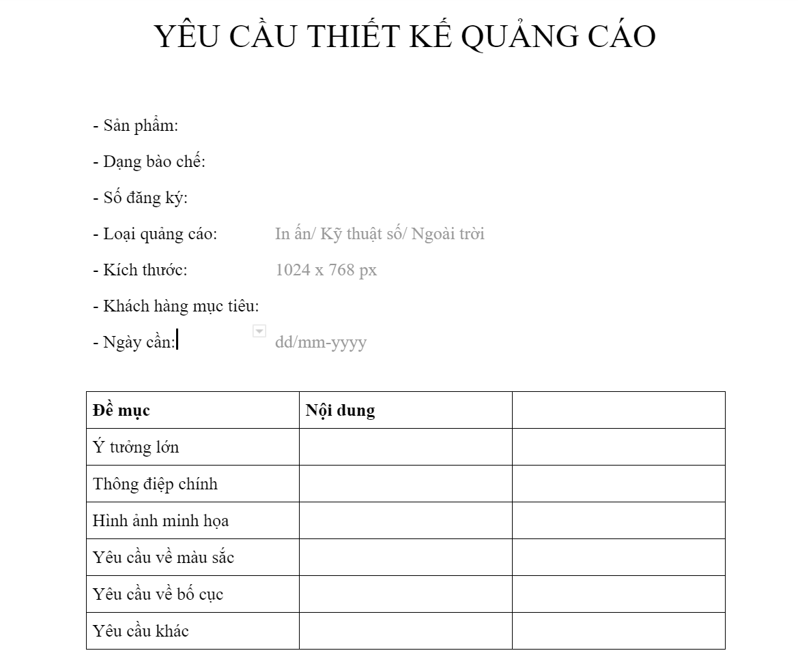

# Design require

Sử dụng mẫu [Phiếu yêu cầu thiết kế](https://docs.google.com/document/d/1L6qk3ZfM7718b044ZqyHT8JeOD0ojZ_JWnO7kjM1-PE/edit?usp=sharing) để chuyển bộ phận thiết kế.

Trong đó:
* Kích thước gồm một số loại thường dùng như:
	- Tờ rơi hai trang: 640 x 1024 (px)
	- Tờ rơi bốn trang: 1200 x 1024 (px)
	- Kích thước quảng cáo
	
| Publisher | Position | Dimention |
| --- | --- | --- |
| One2Fly | Nguyên trang | 216 x 291 |
| Jetstar | Nguyên trang | 216 x 291 |

Xem thêm [Yêu cầu nội dung khi thiết kế](../content-requirements.md)