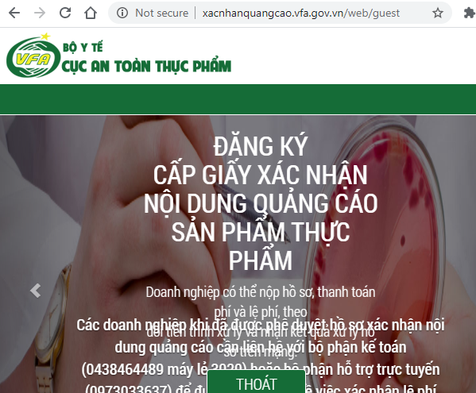
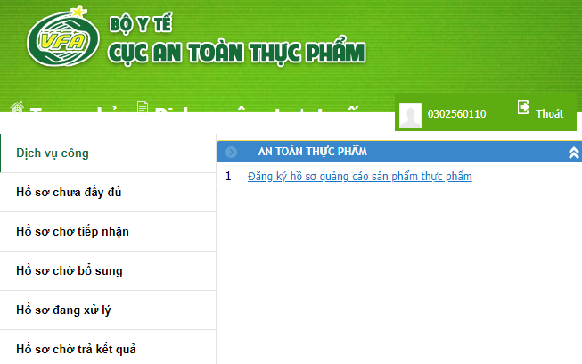
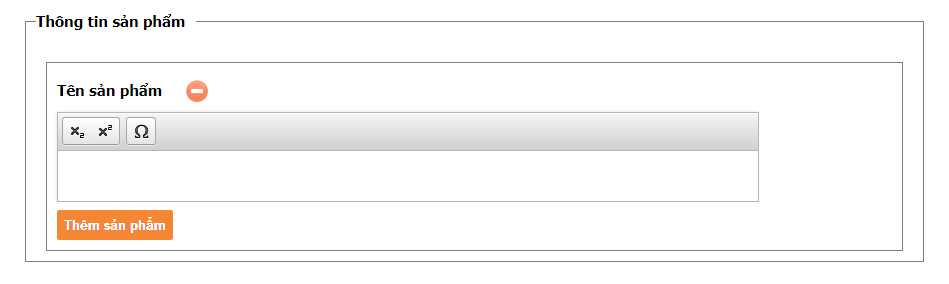
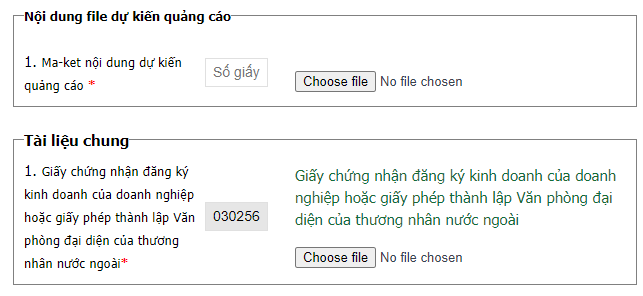

## Đăng ký quảng cáo thực phẩm chức năng
Thực hiện đăng ký quảng cáo thực phẩm chức năng.

## Hồ sơ đăng ký
Hồ sơ đăng ký bao gồm:
1. Đơn đăng ký xác nhận nội dung quảng cáo theo Mẫu số 10 Phụ lục 1 Nghị định số 15/2018/NĐ-CP,
2. Giấy chứng nhận đăng ký kinh doanh,
3. Giấy tiếp nhận đăng ký bản công bố sản phẩm,
4. Bản công bố sản phẩm,
5. Mẫu nhãn sản phẩm,
6. Nội dung quảng cáo, bao gồm maquette (quảng cáo in ấn) hoặc kịch bản dự kiến và nội dung dự kiến ghi trong đĩa (quảng cáo tiếng, hình),
7. Tài liệu khác:
    * GIấy chứng nhận đăng ký nhãn hiệu OPC.

> Tất cả hồ sơ trên chỉ cần đóng dấu công ty, không bắt buộc phải công chứng.

[Xem thêm yêu cầu nội dung.](./content-requirements.md#quang-cao-tpcn)

## Quy trình
1. Sau khi thiết kế xong thì trình Tổng ký duyệt Đơn đăng ký xác nhận nội dung quảng cáo,
2. Nộp hồ sơ trực tuyến tại [Xác nhận nội dung quảng cáo](http://xacnhanquangcao.vfa.gov.vn/),
3. Thanh toán phí bằng hình thức chuyển khoản,
4. Nhận biên lai,
5. Cục An Toàn Thực Phẩm tiến hành xét duyệt.
* Cấp giấy xác nhận nội dung quảng cáo trong vòng 10 ngày (chỉ được yêu cầu sửa đổi, bổ sung 1 lần duy nhất)
* Nếu có yêu cầu sửa đổi, bổ sung thì Cục phải ban hành công văn trong vòng 10 ngày.
* Doanh nghiệp sửa đổi, bổ sung trong vòng 90 ngày.
* Cục cấp giấy xác nhận nội dung quảng cáo trong vòng 10 ngày kể từ ngày nhận được hồ sơ sửa đổi, bổ sung.

## Thao tác trực tuyến
Để thực hiện đăng ký xấc nhận nội dung quảng cáo thực phẩm chức năng, Cục An Toàn Thực phẩm đã xây dựng hệ thống đăng ký trực tuyến (mức độ 4). Các bước thao tác như sau:
1. Truy cập website [Xác nhận quảng cáo](http://xacnhanquangcao.vfa.gov.vn/) -> đăng nhập. 

2. Truy cập vào "Dịch vụ công trực tuyến" -> Tại tab "Dịch vụ công" (mặc định) click vào nút **Đăng ký hồ sơ quảng cáo sản phẩm thực phẩm**.

Hệ thống sẽ hiển thị "xác nhận cập nhật thông tin doanh nghiệp hay không" -> chọn không.

3. Nhập thông tin sản phẩm

Nhập tên sản phẩm theo nguyên văn của Giấy xác nhận công bố. Sau đó nhấn nút "Thêm sản phẩm"

4. Chọn phương tiện quảng cáo

Nếu quảng cáo trên phương tiện nằm ngoài bảng liệt kê thì chọn mục 	"Loại khác" và nhập thông tin vào.

5. Click chọn "Đồng ý" và nhấn nút "Chuyển sang bước đính kèm giấy tờ".

6. Tải lên file ma-ket và Giấy chứng nhận đăng ký kinh doanh của doanh nghiệp

Trong đó, "số giấy" là số nội bộ của ma-ket (nếu có).

7. Tải lên các tài liệu đính kèm

* Giấy xác nhận công bố sản phẩm.
* Bản thông tin chi tiết về sản phẩm đã được cơ quan có thẩm quyền xác nhận.
* Mẫu nhãn sản phẩm đã được cơ quan y tế có thẩm quyền chấp nhận.
* Tài liệu tham khảo, tài liệu khoa học chứng minh cho thông tin quảng cáo.

8. Trình ký đơn đề nghị
Sau khi đã tải lên hết các tài liệu thì in đơn đăng ký và trình ký Tổng Giám Đốc (nút *In đơn đăng ký* ở góc trên bên phải).
Sau khi Tổng Giám Đốc ký xong thì nhấn nút **Tải lên đơn đăng ký** ở phía dưới để tải lên đơn. Nếu không thì có thể chọn **Hoàn tất hồ sơ** để lưu lại hồ sơ và bổ sung đơn đăng ký sau.

Chuyển sang tab "Hồ sơ chưa đầy đủ" sẽ thấy các đơn đang chờ nộp. Nhấn vào icon hình cái kẹp giấy để tải lên đơn đăng ký hoặc click vào hồ sơ và chọn *Sửa hồ sơ* để cập nhật nội dung hồ sơ.

Sau khi đã tải lên tất cả hồ sơ thì tiến hành thanh toán.

9. Tiến hành thanh toán
Mặc định của hệ thống là thanh toán bằng hình thức trực tuyến. Tuy nhiên, công ty chưa áp dụng hình thức này nên vẫn tiến hành thực hiện thanh toán bằng hình thức chuyển khoản như thông thường. Sau khi chuyển khoản xong thì tải lên giấy *Ủy nhiệm chi".
Trước khi thanh toán thì hồ sơ hiển thị ở tab "Hồ sơ chưa đầy đủ", sau khi thanh toán thì hiển thị ở "Hồ sơ chờ tiếp nhận".

10. Theo dõi định kỳ.
Sau khi hồ sơ đã được tiếp nhận thì định kỳ hằng tuần truy cập vào website [Xác nhận quảng cáo](http://xacnhanquangcao.vfa.gov.vn/) để cập nhật tiến độ xử lý của Cục An Toàn Thực Phẩm.

