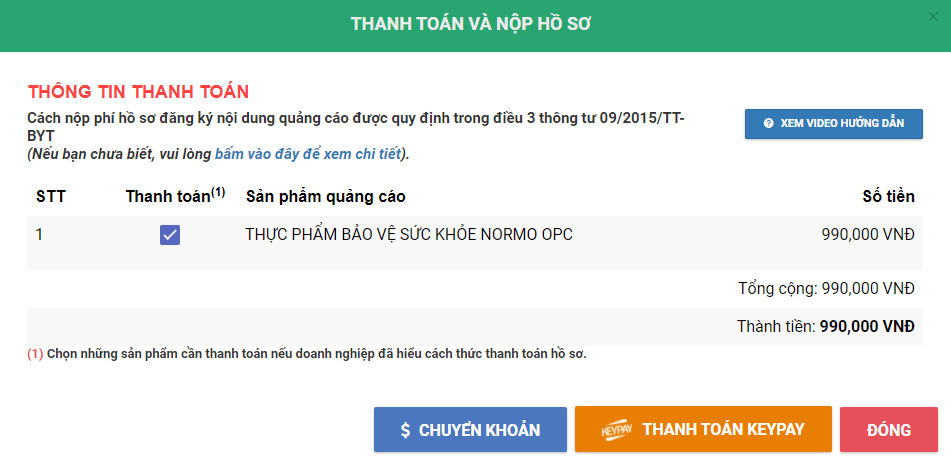
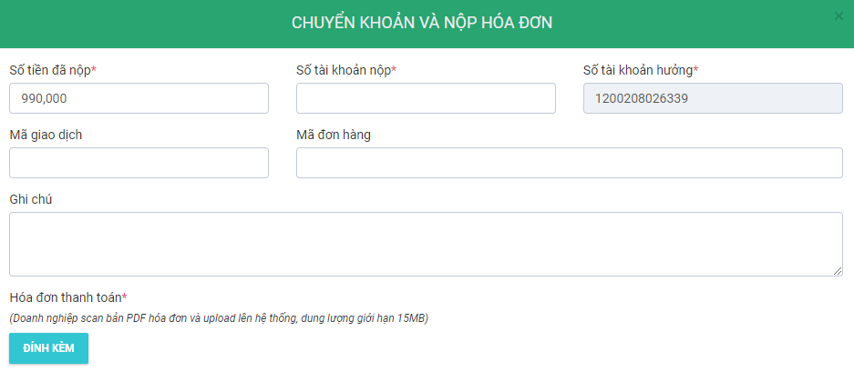

## Đăng ký quảng cáo thực phẩm chức năng
Thực hiện đăng ký quảng cáo thực phẩm chức năng.

## Hồ sơ đăng ký
Hồ sơ đăng ký bao gồm:
1. Đơn đăng ký xác nhận nội dung quảng cáo theo Mẫu số 10 Phụ lục 1 Nghị định số 15/2018/NĐ-CP,
2. Giấy chứng nhận đăng ký kinh doanh,
3. Giấy tiếp nhận đăng ký bản công bố sản phẩm,
4. Bản công bố sản phẩm,
5. Mẫu nhãn sản phẩm,
6. Nội dung quảng cáo, bao gồm maquette (quảng cáo in ấn) hoặc kịch bản dự kiến và nội dung dự kiến ghi trong đĩa (quảng cáo tiếng, hình),
7. Tài liệu khác:
    * GIấy chứng nhận đăng ký nhãn hiệu OPC.

> Tất cả hồ sơ trên chỉ cần đóng dấu công ty, không bắt buộc phải công chứng.

[Xem thêm yêu cầu nội dung.](./content-requirements.md#quang-cao-tpcn)

## Quy trình
1. Sau khi thiết kế xong thì trình Tổng ký duyệt Đơn đăng ký xác nhận nội dung quảng cáo,
2. Nộp hồ sơ trực tuyến tại [Xác nhận nội dung quảng cáo](http://xacnhanquangcao.vfa.gov.vn/),
3. Thanh toán phí bằng hình thức chuyển khoản,
4. Nhận biên lai,
5. Cục An Toàn Thực Phẩm tiến hành xét duyệt.
* Cấp giấy xác nhận nội dung quảng cáo trong vòng 10 ngày (chỉ được yêu cầu sửa đổi, bổ sung 1 lần duy nhất)
* Nếu có yêu cầu sửa đổi, bổ sung thì Cục phải ban hành công văn trong vòng 10 ngày.
* Doanh nghiệp sửa đổi, bổ sung trong vòng 90 ngày.
* Cục cấp giấy xác nhận nội dung quảng cáo trong vòng 10 ngày kể từ ngày nhận được hồ sơ sửa đổi, bổ sung.

## Thao tác trực tuyến
Để thực hiện đăng ký xấc nhận nội dung quảng cáo thực phẩm chức năng, Cục An Toàn Thực phẩm đã xây dựng hệ thống đăng ký trực tuyến (mức độ 4). Các bước thao tác như sau:
1. Truy cập website [Nghị định 15](https://nghidinh15.vfa.gov.vn/) -> đăng nhập. 

Chọn menu **QL quảng cáo**/ Đăng ký hồ sơ.

2. Thêm hồ sơ mới

Tại màn hình **Quản lý quảng cáo** ở trên, click vào nút **Thêm mới hồ sơ** để bắt đầu nhập dữ liệu cho một hồ sơ mới.

3. Nhập thông tin sản phẩm

Trong màn hình thêm mới hồ sơ sẽ có 3 tab như hình bên dưới. Bắt đầu nhập thông tin sản phẩm và công ty ở tab **Thông tin cơ sở đăng ký**.

Các thông tin "Tên doanh nghiệp", "Địa chỉ", "Điện thoại" hệ thống tự lấy từ thông tin tài khoản nên không cần thao tác gì khác.
Chọn phương tiện quảng cáo.

Nhập thông tin sản phẩm mong muốn quảng cáo. Nếu số công bố sản phẩm đã tồn tại trên hệ thống thì mục "Đã có giấy XNCB trên hệ thống" tự động chuyển thành dấu :heavy_check_mark: từ dấu :x:. Sau đó, các trường "Tên sản phẩm", "Ngày tiếp nhận bản đăng ký sản phẩm" cũng tự động hiển thị dữ liệu đã lưu trên hệ thống.

4. Tải lên file ma-ket

Chuyển sang tab "Maket/ Kịch bản quảng cáo" để tải lên maquette. Tùy theo phương tiện quảng cáo đã chọn (Truyền hình/ phát thanh/ in ấn) mà hệ thống chỉ cho phép tải lên những định dạng nhất định.

Nếu cần tải nhiều file thì sau khi đã tải lên 1 file chọn *Thêm* để tải file tiếp theo. Nếu cần thay đổi/ chỉnh sửa file thì chỉ cần tải lên file mới để thay thế file cũ là được.

5. Tải lên các tài liệu đính kèm

Chuyển sang tab "Tài liệu đính kèm" để tải lên các file tài liệu đính kèm.
- Giấy công bố sản phẩm: bao gồm cả bản tự công bố của doanh nghiệp (có chứa thông tin chi tiết sản phẩm) và mẫu nhãn.
- Giấy chứng nhận đăng ký doanh nghiệp.
- Các giấy tờ khác (nếu cần).

Sau khi đã nhập đầy đủ hết các dữ liệu cần thiết thì nhấn nút "Lưu hồ sơ". Sau đó, hệ thống sẽ tự động sinh mã hồ sơ, nếu chọn "Lưu nháp" thì hệ thống chưa sinh mã hồ sơ.

6. Ký số

Tại màn hình quản lý hồ sơ, chọn lệnh **Ký điện tử** từ nút **Thao tác**. Để thực hiện ký số thì trước đó cần cắm token vào máy tính và hệ thống đã cài đặt chữ ký số. Nếu chưa cài đặt thì liên hệ IT để cài chữ ký số.

::: warning
Nộp hồ sơ trực tuyến không yêu cầu Tổng Giám Đốc ký trực tiếp vào tờ đơn đăng ký (chỉ cần ký số). Tuy nhiên, nếu cần chữ ký của Tổng Giám Đốc để thực hiện thủ tục thanh toán thì vẫn soạn văn bản và ký như bình thường.
:::

7. Thanh toán

Để thực hiện thanh toán, chọn lệnh **Nộp hồ sơ** từ nút **Thao tác** (!!!).

Nếu chọn hình thức thanh toán trực tuyến thì nhấn nút **Thanh toán KEYPAY** nhưng hiện tại công ty chưa áp dụng hình thức này. Chọn **Chuyển khoản** để thực hiện thanh toán bằng hình thức chuyển khoản.
- Số tài khoản: 1200208026339
- Ngân hàng: Agribank chi nhánh Sở giao dịch
- Nội dung: Cục không có quy định bắt buộc về nội dung chuyển khoản, gợi ý nội dung như sau "Đăng ký hồ sơ quảng cáo TPBVSK NORMO OPC (Mã hồ sơ 21.02.01.7484.DKQC)"

Điền thông tin và tải lên ủy nhiệm chi như hình trên.
Sau khi nhấn nút **lưu** thì hồ sơ tự động sẽ chuyển sang tab **Hồ sơ đã gửi thanh toán**. Chọn lệnh **Xem thanh toán** ở nút **Thao tác** của danh sách hồ sơ.

Lúc này, trạng thái của hồ sơ là "Giao dịch đang chờ kết quả".

::: tip
Thời gian để chờ xác nhận thanh toán có thể vài ngày hoặc 1 tuần.
:::

8. Theo dõi định kỳ.

Sau khi hồ sơ đã được tiếp nhận thì định kỳ hằng tuần truy cập vào website [Nghị định 15](https://nghidinh15.vfa.gov.vn/) để cập nhật tiến độ xử lý của Cục An Toàn Thực Phẩm.

