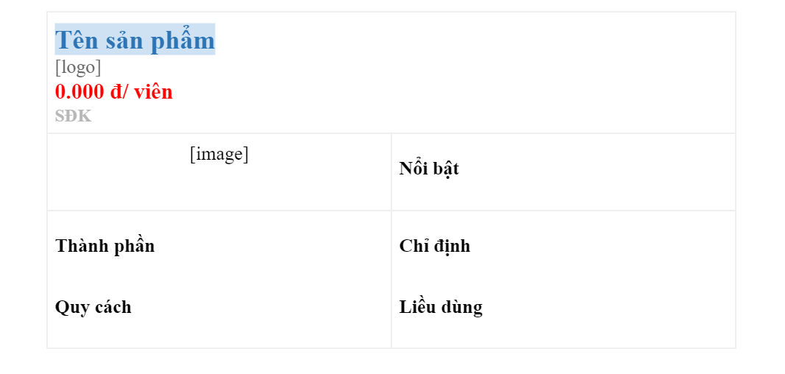

# Competitor
## Phân loại
Đối thủ cạnh tranh được chia làm 2 nhóm như sau:
### Đối thủ trực tiếp
    - ETC: là các đối thủ cùng công thức.
    - OTC: là các đối thủ cùng công dụng/ chỉ định/ thành phần chính.

::: tip
Người thu thập tự định nghĩa và giới hạn đối thủ trực tiếp. Thông thường cần thu thập 5 - 10 đối thủ, trường hợp số lượng đối thủ ít thì mở rộng dần theo thứ tự.

Cùng công thức, dạng bào chế > Khác thành phần phụ > Cùng nhóm hoạt chất.
:::

### Đối thủ gián tiếp
Đối thủ gián tiếp là các sản phẩm có khả năng thay thế cho nhau. Thông thường, đối thủ gián tiếp bao gồm các sản phẩm khác công thức nhưng cùng nhóm dược lý với sản phẩm cần thu thập.

## Nội dung
Các thông tin cần thu thập của một đối thủ bao gồm:

- Tên sản phẩm
- [Công ty/ Logo](https://docs.google.com/document/d/1i3CIAB4D_ZD3s6xThJ407UpnQe4fCVwssRsYuEjKnyU/edit?usp=sharing)
- Giá
- Số đăng ký/ Số công bố
- Hình ảnh (link đến trang sản phẩm)
- Công thức
- Quy cách đóng gói, dạng bào chế
- Công dụng/ Chỉ định
- Liều dùng

Bên cạnh đó là các thông tin nổi bật của sản phẩm:
- Chiến lược sản phẩm
- Kênh phân phối
- Chương trình bán hàng
- Hoạt động truyền thông
- Thị phần, thị trường

::: tip
Logo công ty lấy ở [file này](https://docs.google.com/document/d/1i3CIAB4D_ZD3s6xThJ407UpnQe4fCVwssRsYuEjKnyU/edit?usp=sharing). Nếu công ty nào chưa có thì bổ sung thêm.
:::

Đối với đối thủ gián tiếp thì chỉ cần thu thập thông tin rút gọn bao gồm:
- Hình ảnh (link đến trang sản phẩm)
- Tên sản phẩm
- [Công ty/ Logo](https://docs.google.com/document/d/1i3CIAB4D_ZD3s6xThJ407UpnQe4fCVwssRsYuEjKnyU/edit?usp=sharing)
- Miêu tả ngắn gọn

## Quy trình
1. Nhân bản file [TEMPLATE](https://docs.google.com/document/d/18T2i6oe_4vASBozGn6WQamO6S5DTlLhAWvVsald5Lj4/edit?usp=sharing).
2. Thu thập thông tin đối thủ cạnh tranh.
3. Liệt kê lợi thế cạnh tranh của sản phẩm.
4. Lấy link gắn vào [Danh sách đối thủ COMPETITOR](https://docs.google.com/spreadsheets/d/1lMedbKd5JEgq5JNYBRlUP7NNr_4XEIwIPalf7HUqvdQ/edit?usp=sharing) và file Detail của sản phẩm.
5. Chia sẻ file cho nhóm.

Để tìm kiếm thông tin đối thủ cạnh tranh thì có thể dựa vào các tài liệu khác của sản phẩm như:
- [Thống kê kê khai giá](https://docs.google.com/spreadsheets/d/1DcL1PwOaiI2vvxY8j2QgV6jCnpWRg4SzEH8npmIP82s/edit?usp=sharing)
- [Phân tích thầu](https://docs.google.com/spreadsheets/d/1UMyRgw_6M0_NqgHOjQhEHfR8lMctvYVZA9Ce7Tb2IjQ/edit?usp=sharing)
- Phác đồ điều trị
- Tìm tên bài thuốc/ thành phần chính/ công dụng chính trên công cụ tìm kiếm